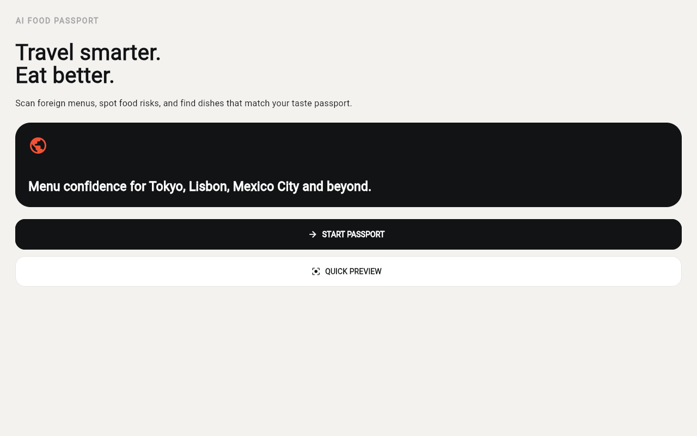
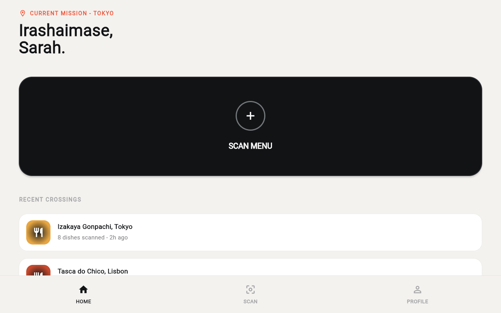
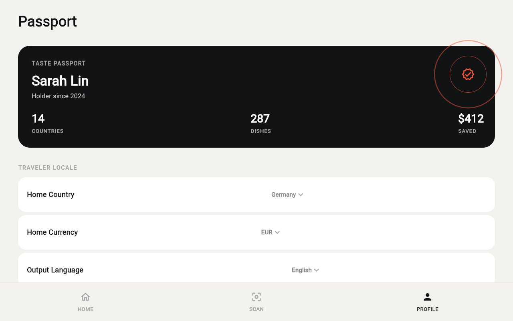
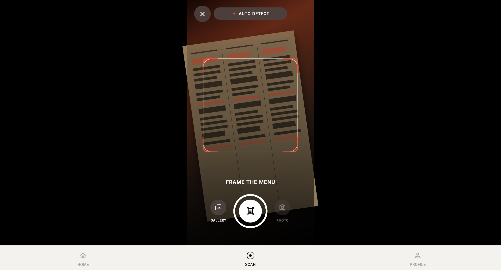
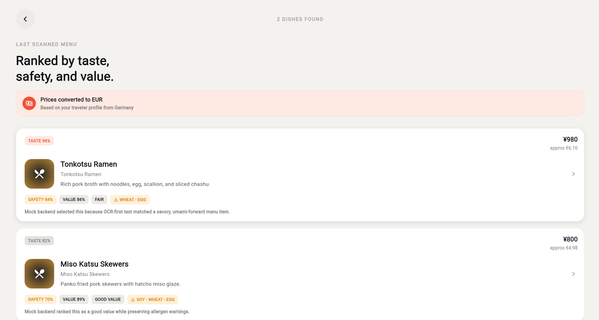
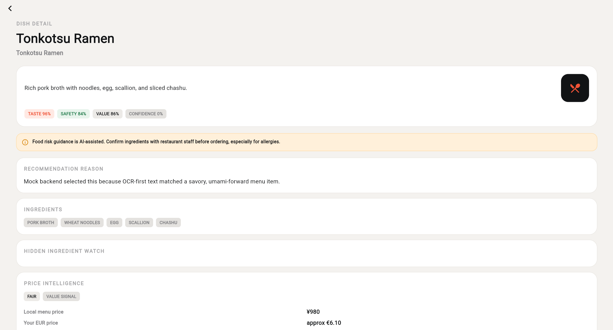
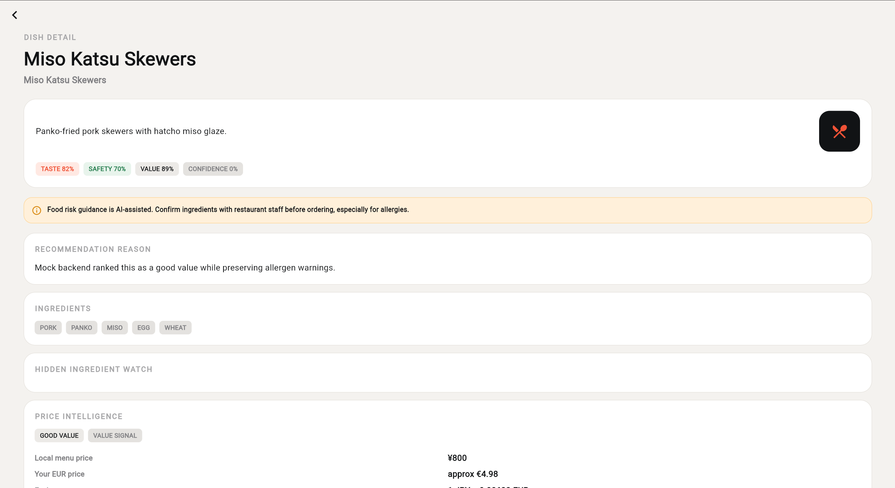

# MVP Alpha Demo Showcase

> **Status**: Mock-only. All real providers disabled. Ready to demo.
> **Last updated**: 2026-06-14 (Phase 18C)

---

## What Is AI Food Passport?

AI Food Passport is a Flutter mobile application that helps travelers understand foreign menus. Point your camera at a menu — any language, any cuisine — and the app uses OCR + AI analysis to:

1. **Extract and translate** every dish on the menu.
2. **Match dishes to your taste profile** — dietary preferences, allergies, taste affinities.
3. **Convert prices to your home currency** with exchange-rate awareness.
4. **Flag what's safe, risky, or worth trying** based on your profile.

This MVP Alpha demonstrates the complete scan → results → dish detail flow against a live Render backend in mock-only mode.

---

## Demo Screenshot Tour

The demo flow takes the traveler from onboarding through a Tokyo menu scan, producing 2 mock dishes from the Render backend.

### 00 — Onboarding

The first screen every user sees. Introduces AI Food Passport with a **QUICK PREVIEW** button that launches a demo scan immediately — no setup required.



### 01 — Home

The main hub. Shows the **CURRENT MISSION** (Tokyo), a **SCAN MENU** call-to-action card, and **Recent Crossings** (Izakaya Gonpachi, Tokyo). Bottom navigation tabs: Home, Scan, Profile.



### 02 — Profile

Traveler settings screen. Configure home country, home currency, output language, taste preferences, dietary restrictions, and allergies. All settings persist locally via `shared_preferences`.



### 03 — Scan

The scanning interface. Users can select a menu image from the gallery or tap the capture button directly. A processing overlay shows staged progress messages (Preparing OCR → Extracting text → Analyzing dishes → Finalizing).



### 04 — Results

After scanning, the results screen shows **2 dishes found** with price intelligence. Each dish card displays the dish name, local price, home-currency price, allergens, and a taste match indicator.



### 05 — Dish Detail: Tonkotsu Ramen

Tapping the Tonkotsu Ramen card opens the detail view. Shows local price (¥980), home-currency price with exchange rate, full ingredient list, allergen warnings, and the AI recommendation reason.



### 06 — Dish Detail: Miso Katsu Skewers

Tapping the Miso Katsu Skewers card shows its detail view: local price (¥800), home-currency price, ingredients, allergens (Soy, Wheat, Egg), and recommendation reason.



---

## How to Run the Demo

```bash
cd AI-Food-Passport
flutter run -d web-server --web-hostname=127.0.0.1 --web-port=8081 --dart-define=BACKEND_BASE_URL=https://ai-food-passport.onrender.com
```

Opens Flutter Web at `http://127.0.0.1:8081`, connected to the live Render mock backend.

> **Important**: Do a full restart of `flutter run` (not hot-reload). Riverpod `StateProvider` preserves state on hot-reload, which may prevent the backend connection fix from taking effect.

### Demo Flow

1. Open the app (Onboarding screen).
2. Tap **QUICK PREVIEW** — launches a demo scan without setup.
3. The app connects to the Render backend and returns 2 mock dishes.
4. Review the results: **Tonkotsu Ramen** and **Miso Katsu Skewers**.
5. Tap each dish to see its detail page with price intelligence.
6. Navigate to Profile to explore traveler settings.

### Verify Backend Connection

Open Chrome DevTools **Network** tab. After triggering the scan, you should see:

- `POST /api/analyze-menu` — request to `https://ai-food-passport.onrender.com`
- Response: `{ "ok": true, "data": { "dishes": [...] } }`

---

## System Configuration

### Backend (Render)

| Field | Value |
|---|---|
| URL | `https://ai-food-passport.onrender.com` |
| `activeOcrProvider` | `mock_ocr` |
| `activeAnalysisProvider` | `mock_ai` |
| `realOcrEnabled` | `false` |
| `realAnalysisEnabled` | `false` |
| `realProvidersEnabled` | `false` |
| `productionReady` | `false` |
| `configValid` | `true` |
| API Keys Configured | **None** |

### Expected Demo Dishes

These are **deterministic mock dishes** returned by the backend. They never change.

| # | Dish | Price | Allergens | Reason |
|---|---|---|---|---|
| 1 | **Tonkotsu Ramen** | ¥980 | Wheat, Egg | Rich pork broth ramen — a hearty classic. Mild spice level, generally safe for most travelers. |
| 2 | **Miso Katsu Skewers** | ¥800 | Soy, Wheat, Egg | Crispy fried skewers with savory miso glaze. Contains soy and wheat — check your allergy settings. |

---

## Safety & Architecture

### API Keys Are Backend-Only

- No API keys, secrets, or provider credentials exist in the Flutter codebase.
- The `BACKEND_BASE_URL` dart-define is a **public URL** — not a secret.
- All future provider API keys (`QWEN_API_KEY`, etc.) belong in backend deployment environment variables only.
- Flutter CI/CD includes automated secret-pattern rejection tests.

### Mock-Only Mode

- Both OCR and Analysis providers are `mock_ocr` and `mock_ai`.
- All real provider implementations exist behind explicit **safety gates** (3 environment variables each).
- No real provider has ever been enabled on the deployed Render instance.
- 509 backend tests validate the provider gate contract.

### Production Readiness

- `productionReady` remains `false` — this is intentional.
- The demo is suitable for portfolio review, investor pitches, and team onboarding.
- Full production deployment requires real provider keys, Firebase integration, and security hardening.

---

## Known Limitations

| Limitation | Detail |
|---|---|
| **Mock-only** | All results are deterministic mock data. No real OCR or AI analysis runs. |
| **Render sleep** | Free-tier instances spin down after 15 minutes of inactivity. First request after sleep may take 30-60 seconds. |
| **No homepage** | `GET /` returns 404 by design. Use `GET /health` or `POST /api/analyze-menu`. |
| **No real providers** | Qwen OCR and Qwen Analysis are implemented but disabled behind safety gates. |
| **No API keys** | No QWEN_API_KEY, DeepSeek key, or any provider key is configured anywhere. |
| **No Firebase** | Authentication, cloud sync, and persistent storage are not integrated. |
| **Web-only demo** | Current demo runs as Flutter Web. iOS/Android builds are planned for later phases. |
| **Developer controls hidden** | Debug toggles are hidden in release builds by default. |

---

## Related Documents

| Document | Purpose |
|---|---|
| [README.md](README.md) | Full project overview, architecture, and developer guide |
| [MVP_ALPHA_STATUS.md](MVP_ALPHA_STATUS.md) | One-page MVP Alpha status overview |
| [MVP_ALPHA_DEMO_RUNBOOK.md](MVP_ALPHA_DEMO_RUNBOOK.md) | Step-by-step demo script and manual QA runbook |
| [MVP_ALPHA_RELEASE_SNAPSHOT.md](MVP_ALPHA_RELEASE_SNAPSHOT.md) | Frozen Alpha baseline snapshot |
| [MVP_ALPHA_SCREENSHOT_PLAN.md](MVP_ALPHA_SCREENSHOT_PLAN.md) | Screenshot capture plan |
| [PHASE_18B0_REPORT.md](PHASE_18B0_REPORT.md) | Screenshot data source alignment report |
| [REAL_PROVIDER_PREFLIGHT_PLAN.md](REAL_PROVIDER_PREFLIGHT_PLAN.md) | Real provider safety gates and enablement plan |
| [ROADMAP.md](ROADMAP.md) | Full phase history and future plans |

---

## Test Suite

| Suite | Tests | Status |
|---|---|---|
| Flutter unit/widget | 42 | All pass |
| Backend contract (realProviderGate) | 68 | All pass |
| Backend unit (Qwen providers) | 158 | All pass |
| Backend total | 509+ | All pass |
| Git (`diff --check`, `status --short`) | — | Clean |
